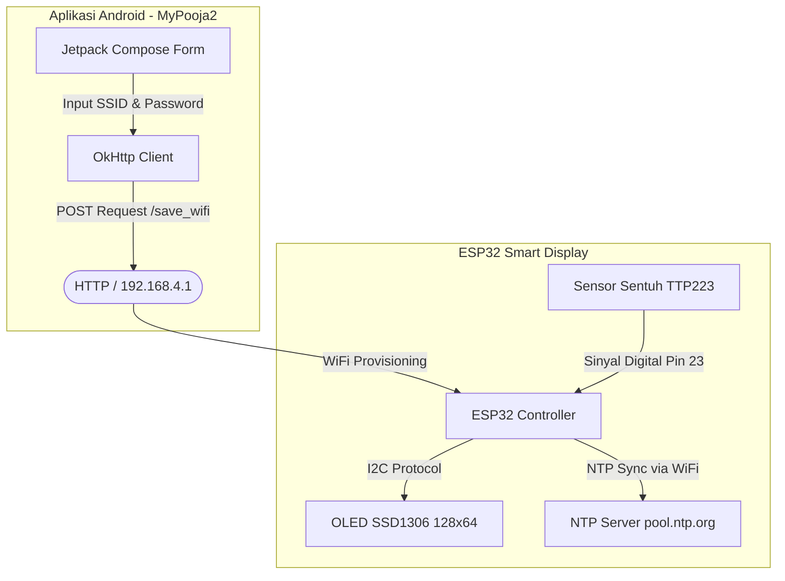

# 🤖 Project Dasaimochi: ESP32 Smart Display & Android WiFi Controller

Proyek ini adalah sistem display pintar berbasis **ESP32** dengan layar **OLED SSD1306** dan **Sensor Sentuh Kapasitif TTP223**, terintegrasi dengan **Aplikasi Android** custom untuk konfigurasi jaringan WiFi secara dinamis.

Proyek ini terdiri dari dua komponen utama:
1. **Firmware ESP32 (`sketch_may22a.ino`)**: Mengontrol tampilan OLED, memproses input sentuh untuk mengganti mode, sinkronisasi waktu NTP secara real-time, dan menampilkan animasi interaktif.
2. **Aplikasi Android (`MyPooja2`)**: Aplikasi berbasis **Kotlin** dan **Jetpack Compose** untuk mengirimkan kredensial WiFi (SSID & Password) ke ESP32 melalui protokol HTTP.

---

## 🗺️ System Architecture



---

## ⚡ Fitur Utama

### 1. Firmware ESP32 (Smart Clock & Display)
Menggunakan sensor sentuh untuk berpindah di antara **3 Mode Tampilan**:
*   **Mode 0: Animasi Interaktif & Mata Kotak**
    *   Menampilkan dua mata kotak dinamis yang berkedip secara otomatis dan melirik ke kiri-kanan menggunakan formula gelombang sinus (`sin(millis() / 300.0) * 4`).
    *   Memainkan animasi bitmap frame-by-frame di bagian bawah layar.
*   **Mode 1: Pesan Kustom (Greeting)**
    *   Menampilkan teks personalisasi hangat: `"Hallo Rachel"`.
*   **Mode 2: Jam Digital Presisi Tinggi (NTP Clock)**
    *   Sinkronisasi otomatis dengan server waktu dunia (`pool.ntp.org`) melalui koneksi WiFi.
    *   Format waktu Waktu Indonesia Barat (WIB) GMT+7.
    *   Menampilkan indikator koneksi berupa ikon WiFi di pojok kanan atas.
    *   Menampilkan hari dalam Bahasa Indonesia (Senin - Minggu) dan tanggal berformat `DD/MM/YYYY`.

### 2. Aplikasi Android (WiFi Provisioner)
*   **UI Modern**: Dibangun menggunakan Jetpack Compose dengan Material Design 3.
*   **WiFi Setup Form**: Form input SSID dan password WiFi yang user-friendly dengan visibilitas password yang aman.
*   **Protokol Komunikasi**: Mengirimkan data WiFi dalam bentuk JSON (`{"ssid":"...","password":"..."}`) via POST request ke `http://192.168.4.1/save_wifi`.
*   **Asynchronous Processing**: Proses pengiriman data berjalan di background thread dengan Kotlin Coroutines dan OkHttp, memastikan UI tetap responsif.

---

## 🔌 Skema Koneksi Perangkat Keras (Hardware Pinout)

Berikut adalah konfigurasi pin untuk menghubungkan ESP32 dengan OLED Display dan Sensor Sentuh TTP223:

| Komponen | Pin ESP32 | Pin Komponen | Keterangan |
| :--- | :--- | :--- | :--- |
| **OLED SSD1306** | `GPIO 21` | `SDA` | Jalur data I2C |
| | `GPIO 22` | `SCL` | Jalur clock I2C |
| | `3.3V` / `5V` | `VCC` | Daya positif |
| | `GND` | `GND` | Ground |
| **Sensor TTP223**| `GPIO 23` | `I/O` / `SIG` | Input Digital Sentuh |
| | `3.3V` | `VCC` | Daya positif |
| | `GND` | `GND` | Ground |

---

## 💻 Panduan Instalasi & Penggunaan

### 1. Mempersiapkan Firmware ESP32
1. Buka file [sketch_may22a.ino](file:///c:/Users/Carol/OneDrive/Documents/Arduino/sketch_may22a/sketch_may22a.ino) di **Arduino IDE**.
2. Pastikan Anda telah menginstal Board Manager untuk ESP32.
3. Instal library yang dibutuhkan melalui **Library Manager**:
   *   `Adafruit SSD1306`
   *   `Adafruit GFX Library`
4. Sesuaikan konfigurasi WiFi default di dalam kode jika diperlukan:
   ```cpp
   const char* ssid = "AndroidAP_2821";
   const char* password = "pooja28";
   ```
5. Pilih board **ESP32 Dev Module** (atau board ESP32 yang sesuai) dan port COM yang terdeteksi.
6. Klik **Upload** untuk memasukkan program ke ESP32.

### 2. Mempersiapkan Aplikasi Android
1. Buka folder [MyPooja2](file:///c:/Users/Carol/OneDrive/Documents/Arduino/sketch_may22a/MyPooja2) menggunakan **Android Studio**.
2. Sinkronisasikan project Gradle agar dependensi terunduh dengan lengkap.
3. Hubungkan perangkat Android Anda ke PC (aktifkan USB Debugging) atau gunakan Emulator.
4. Jalankan aplikasi dengan mengklik **Run 'app'**.
5. Hubungkan ponsel Android ke Access Point yang dipancarkan oleh ESP32 (default IP: `192.168.4.1`).
6. Buka aplikasi, masukkan **SSID** dan **Password** WiFi rumah/kantor Anda, lalu tekan **Kirim ke ESP32**.

---

## ⚙️ Dependensi Library & Spesifikasi

### ESP32 Firmware:
*   **WiFi.h** & **time.h**: Library bawaan ESP32 untuk konektivitas internet dan sinkronisasi waktu NTP.
*   **Adafruit_SSD1306 & Adafruit_GFX**: Library standar untuk kontrol tampilan OLED I2C.

### Android App:
*   **Jetpack Compose**: UI toolkit modern untuk Android.
*   **Material 3**: Panduan desain UI terbaru dari Google.
*   **OkHttp3**: Library networking HTTP client yang andal untuk berkirim JSON.
*   **Kotlin Coroutines**: Untuk eksekusi tugas asynchronous secara non-blocking.

---

## 📝 Catatan Tambahan
*   **NTP Sync**: Sinkronisasi waktu membutuhkan koneksi internet aktif. Jika WiFi gagal terhubung atau terputus, layar jam akan menampilkan pesan error atau menampilkan waktu terakhir yang tersinkronisasi.
*   **TTP223 Debounce**: Kode program telah dilengkapi dengan fitur software debounce (`millis() - lastDebounceTime > 600`) untuk mencegah perpindahan mode ganda yang tidak disengaja akibat sensitivitas tinggi dari sensor sentuh kapasitif.
